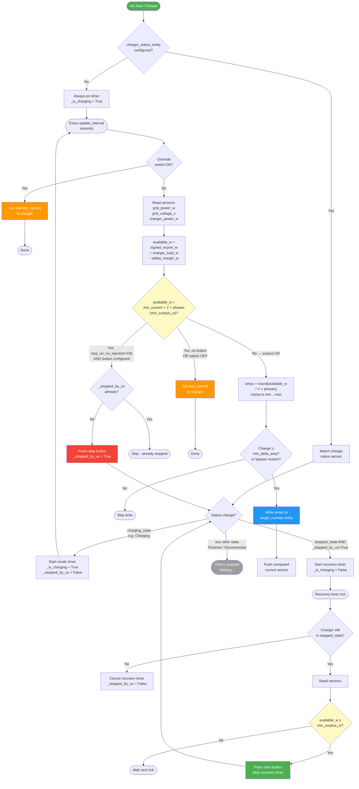

# EV Solar Manager

[](https://github.com/hacs/integration)
[](https://www.home-assistant.io/)

A Home Assistant custom integration that automatically adjusts your EV charger's
charging current to match only the **solar surplus** exported to the grid — so you
charge your car for free with excess solar power instead of buying it from the grid.

A manual **override mode** lets you lock the charger to a fixed current whenever
you need full-speed charging regardless of solar production.

---

## How it works

```
┌─────────────────┐    every N seconds    ┌──────────────────────────────────────┐
│  Grid Power     │ ──────────────────►   │  EVSolarController                   │
│  sensor (W)     │                       │                                      │
├─────────────────┤                       │  available = export + charger_load   │
│  Grid Voltage   │ ──────────────────►   │            - safety_margin           │
│  sensor (V)     │                       │                                      │
├─────────────────┤                       │  I = available / (U × phases)        │
│  Charger Power  │ ──────────────────►   │  clamp(min_current, I, max_current)  │
│  sensor (W) opt │                       │                                      │
└─────────────────┘                       └──────────────┬───────────────────────┘
                                                         │ number.set_value
                                          ┌──────────────▼───────────────────────┐
                                          │  EV Charger Number entity            │
                                          │  (target current in Amperes)         │
                                          └──────────────────────────────────────┘
```

### Logic flow diagram



1. Every `update_interval` seconds the controller reads the **grid power sensor**.
2. It compensates for the EV charger's own consumption (which is already embedded
   in the grid meter reading) to find the true available solar budget:
   ```
   available_watts = grid_export_watts + charger_consumption_watts - safety_margin_w
   ```
   - `charger_consumption_watts` comes from a real sensor (`charger_power_entity`) if
     configured, otherwise it is estimated as `last_set_amps × voltage × phases`.
3. The target current is calculated and **clamped** between `min_current` and `max_current`:
   ```
   charging_amps = round(available_watts / (grid_voltage × phases))
   ```
4. The value is written to the charger entity **only** if the change is at least
   `min_delta_amp` Amperes — to avoid hammering the charger with tiny adjustments.
5. If the available solar budget is **below the minimum viable threshold**
   (`min_current × voltage × phases` watts), the controller stops the charger (if
   `charger_start_stop_button` is configured) or falls back to `min_current` — it
   will **not** silently draw the difference from the grid.

### Stop on no solar surplus

When `charger_start_stop_button` is configured, the integration can automatically
**stop the charger** when the solar surplus is insufficient and **restart it** once
enough surplus returns. This is controlled by `switch.ev_solar_manager_stop_on_no_injection`
(enabled by default).

The stop threshold is based on the **minimum viable charging current** (IEC 61851 ≥ 6 A):

```
min_surplus_w = min_current × grid_voltage × phases
```

If `available_w < min_surplus_w`, the charger would have to draw the deficit from
the grid even at its lowest allowed setting — so the controller stops it instead.

**Example:** `min_current=6`, `voltage=230 V`, `phases=1` → threshold is **1 380 W**.
If another appliance (e.g. a washing machine) starts and reduces the solar export
below 1 380 W — even if some solar is still going out — the charger is stopped.

- Below threshold → controller presses the toggle button → charger stops.
- A recovery timer polls every `update_interval` seconds. When surplus rises back
  above `min_surplus_w`, the button is pressed again → charger resumes.
- If the car is disconnected or the user stops charging manually, the recovery timer
  is cancelled automatically (only restarts when `_stopped_by_us` is `True`).

Without `charger_start_stop_button`, the charger falls back to staying at `min_current`
when the surplus is below threshold (original behaviour).

### Override mode

Turn on `switch.ev_solar_manager_override` to lock the charger to the current set
in `number.ev_solar_manager_override_current`. Solar logic is paused until the
switch is turned off again.

### Manual recalculation

Press `button.ev_solar_manager_recalculate_now` to trigger an immediate
recalculation without waiting for the next `update_interval` tick. Useful for
testing and debugging.

---

## Entities created

| Entity | Type | Description |
|--------|------|-------------|
| `sensor.ev_solar_manager_computed_current` | Sensor (A) | Last current calculated from solar data |
| `switch.ev_solar_manager_override` | Switch | Enable / disable manual override |
| `switch.ev_solar_manager_stop_on_no_injection` | Switch | Stop charger automatically when no solar surplus (requires `charger_start_stop_button`) |
| `number.ev_solar_manager_override_current` | Number (A) | Manual current for override mode |
| `button.ev_solar_manager_recalculate_now` | Button | Trigger an immediate recalculation |

All entities are grouped under a single **EV Solar Manager** device in HA.

---

## Requirements

- Home Assistant **2024.1** or later
- An **EV charger** integration that exposes a `number` entity to set the max current
  (e.g. [Duosida](https://github.com/example/duosida), go-e Charger, Wallbox, …)
- A **grid power sensor** that reports:
  - **negative Watts** when your solar system is exporting to the grid *(most bidirectional meters)*
  - **or positive Watts** if you use a dedicated production sensor *(set `export_is_negative: false`)*
- A **grid voltage sensor** reporting AC voltage in Volts
- *(Optional)* A **charger power sensor** (e.g. Shelly EM) for more accurate compensation

---

## Installation

### Via HACS (recommended)

1. Open **HACS → Integrations → ⋮ → Custom repositories**
2. Add this repository URL and select category **Integration**
3. Search for **EV Solar Manager** and install it
4. Restart Home Assistant

### Manual

1. Copy the `custom_components/ev_solar_manager` folder to your HA config directory:
   ```
   config/
   └── custom_components/
       └── ev_solar_manager/
           ├── __init__.py
           ├── button.py
           ├── const.py
           ├── manifest.json
           ├── number.py
           ├── sensor.py
           └── switch.py
   ```
2. Restart Home Assistant

---

## Configuration

Add the following block to your `configuration.yaml`:

```yaml
ev_solar_manager:
  # --- Required ---
  power_entity: sensor.principal_power          # grid power sensor entity ID
  voltage_entity: sensor.principal_voltage      # grid voltage sensor entity ID
  target_number: number.duosida_set_maximal_current  # charger current number entity ID

  # --- Optional ---
  min_current: 6          # minimum charging current in A (default: 6)
  max_current: 24         # maximum charging current in A (default: 24)
  update_interval: 60     # recalculation interval in seconds (default: 60)
  min_delta_amp: 1        # minimum change in A before writing to charger (default: 1)
  export_is_negative: true   # true if grid sensor is negative when exporting (default: true)
  phases: 1               # charging phases – 1 for single-phase, 3 for three-phase (default: 1)
  charger_power_entity: sensor.shellyem3_xxxx_channel_b_power  # real charger power sensor (W)
  safety_margin_w: 100    # keep this many Watts as buffer to avoid grid import (default: 0)
  charger_status_entity: sensor.duosida_status   # optional: charger status sensor
  charging_state: "Charging"                     # optional: state value that means charging (default "Charging")
  charger_start_stop_button: button.duosida_start_stop_charging  # optional: toggle button
  stopped_state: "Stopped"                       # optional: state value that means stopped/waiting (default "Stopped")
```

### Enable debug logging

```yaml
logger:
  default: warning
  logs:
    custom_components.ev_solar_manager: debug
```

---

## Configuration reference

| Key | Required | Default | Description |
|-----|----------|---------|-------------|
| `power_entity` | ✅ | — | Entity ID of the grid power sensor (W) |
| `voltage_entity` | ✅ | — | Entity ID of the grid voltage sensor (V) |
| `target_number` | ✅ | — | Entity ID of the charger's max-current number entity |
| `min_current` | ❌ | `6` | Minimum charging current in A. IEC 61851 mandates ≥ 6 A |
| `max_current` | ❌ | `24` | Maximum charging current in A |
| `update_interval` | ❌ | `60` | How often to re-read sensors and recalculate (seconds) |
| `min_delta_amp` | ❌ | `1` | Suppresses writes when the change is smaller than this (A) |
| `export_is_negative` | ❌ | `true` | Set to `false` if your power sensor is **positive** when exporting |
| `phases` | ❌ | `1` | Set to `3` if your charger operates on three-phase AC |
| `charger_power_entity` | ❌ | — | Real-time charger power sensor (W). When set, used instead of the estimated value for charger compensation. Recommended for best accuracy. |
| `safety_margin_w` | ❌ | `0` | Watts to keep as buffer. Set to e.g. `100` to always inject ≥100 W to the grid and avoid accidental import. |
| `charger_status_entity` | ❌ | — | Entity ID of the charger status sensor. When set, the recalculation timer runs only while the charger is in `charging_state`. |
| `charging_state` | ❌ | `"Charging"` | State string that means the charger is actively charging. |
| `charger_start_stop_button` | ❌ | — | Entity ID of the charger's start/stop toggle button. Enables automatic stop when no solar surplus and restart when surplus returns. |
| `stopped_state` | ❌ | `"Stopped"` | State string that means the charger is stopped/waiting. Used to confirm the charger stopped after the button press. |

### How to determine `export_is_negative`

Go to **Developer Tools → States** and look at your power sensor while solar
production exceeds consumption:

- Value is `-1500` → sensor is negative when exporting → `export_is_negative: true` ✅
- Value is `+1500` → sensor is positive when exporting → `export_is_negative: false`

### Why use `charger_power_entity`?

The grid meter measures the **net** power at the connection point, which already
includes the EV charger's consumption. Without knowing what the charger is actually
drawing, the controller would underestimate the available solar budget.

With `charger_power_entity` set to a real energy monitor (e.g. a Shelly EM channel
on the charger circuit), the controller uses the **measured** charger power instead
of an estimate, resulting in more accurate and stable current adjustments.

### Dashboard card example

```yaml
type: entities
title: EV Solar Manager
icon: mdi:solar-power
entities:
  - entity: sensor.ev_solar_manager_computed_current
    name: Computed current
  - entity: switch.ev_solar_manager_override
    name: Manual override
  - entity: number.ev_solar_manager_override_current
    name: Override current
  - entity: button.ev_solar_manager_recalculate_now
    name: Recalculate now
    icon: mdi:refresh
```

---

## Troubleshooting

### The charger current never changes

1. Enable debug logging (see above) and look for lines from `custom_components.ev_solar_manager`.
2. Verify the sign of `power_entity` — use Developer Tools → States while solar is producing.
3. Confirm `target_number` matches exactly the entity ID in Developer Tools.
4. Make sure the power sensor is not `unavailable` or `unknown`.

### The charger is always set to `min_current`

Your power sensor is probably **positive** when exporting. Add `export_is_negative: false`.

Also check that your solar surplus exceeds `min_current × voltage × phases` watts (e.g. 1 380 W
for 6 A / 230 V / 1 phase). If another heavy appliance is running, the surplus may be
below this threshold and the charger will remain at `min_current` (no start/stop button)
or be stopped (with start/stop button configured).

### The current still leaves unused solar surplus

Add `charger_power_entity` pointing to a real energy monitor on the charger circuit.
This prevents the controller from underestimating what the charger already consumes.

### The current jumps too aggressively

Increase `min_delta_amp` (e.g. `2` or `3`) to reduce the frequency of changes.  
Increase `safety_margin_w` (e.g. `200`) to add a stable buffer.

### The component fails to load at startup

Check **Settings → System → Logs** for errors from `ev_solar_manager`.
Common causes:
- A typo in an entity ID
- A required key missing from configuration
- Incompatible Home Assistant version (requires 2024.1+)
- UTF-8 BOM in a `.py` or `.json` file (save all files as UTF-8 **without** BOM)

---

## Example automation: stop charging at night

```yaml
automation:
  - alias: "Stop EV charging after sunset"
    trigger:
      - platform: sun
        event: sunset
    action:
      - service: switch.turn_on
        target:
          entity_id: switch.ev_solar_manager_override
      - service: number.set_value
        target:
          entity_id: number.ev_solar_manager_override_current
        data:
          value: 6
```

---

## Contributing

Pull requests and issues are welcome. Please include relevant log lines and your
`configuration.yaml` snippet (without secrets) when reporting a bug.

If you are an AI coding agent or want a quick architectural overview before contributing,
read [`AGENTS.md`](./AGENTS.md) at the project root – it documents the architecture,
file map, design decisions, and conventions specific to this codebase.

---

## License

MIT

