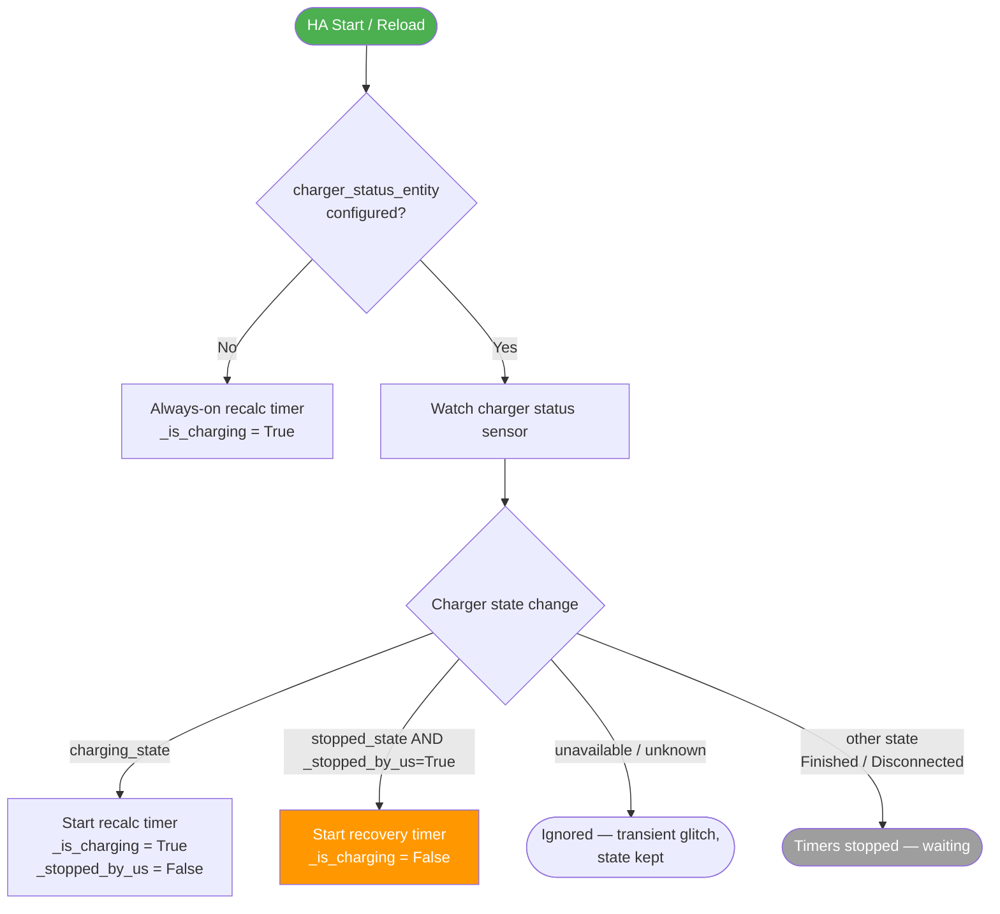
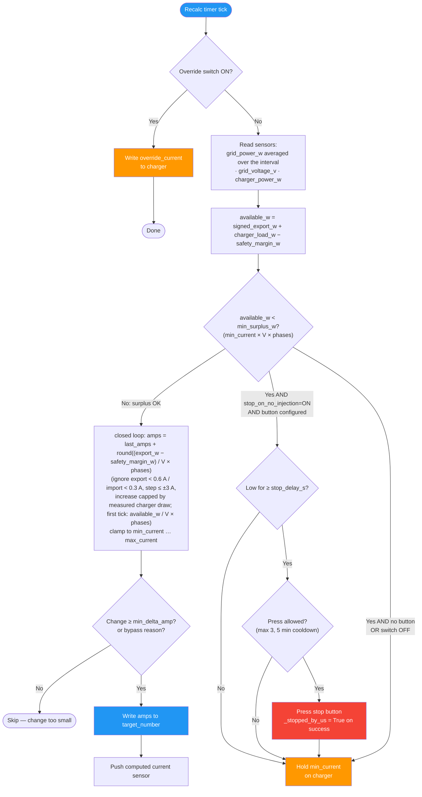
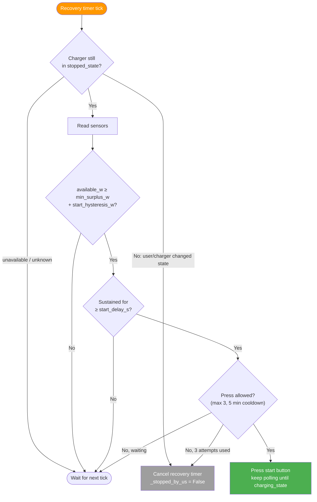

# EV Solar Manager

[](https://github.com/hacs/integration)
[](https://www.home-assistant.io/)

A Home Assistant custom integration that automatically adjusts your EV charger's
charging current to match only the **solar surplus** exported to the grid — so you
charge your car for free with excess solar power instead of buying it from the grid.

A manual **override mode** lets you lock the charger to a fixed current whenever
you need full-speed charging regardless of solar production.

---

## How it works

```
┌─────────────────┐    every N seconds    ┌──────────────────────────────────────┐
│  Grid Power     │ ──────────────────►   │  EVSolarController                   │
│  sensor (W)     │                       │                                      │
├─────────────────┤                       │  available = export + charger_load   │
│  Grid Voltage   │ ──────────────────►   │            - safety_margin           │
│  sensor (V)     │                       │                                      │
├─────────────────┤                       │  I = last_I + (export − margin)      │
│  Charger Power  │ ──────────────────►   │            / (U × phases)            │
│  sensor (W) opt │                       │  closed loop, clamp(min, max_current)│
│                 │                       │                                      │
└─────────────────┘                       └──────────────┬───────────────────────┘
                                                         │ number.set_value
                                          ┌──────────────▼───────────────────────┐
                                          │  EV Charger Number entity            │
                                          │  (target current in Amperes)         │
                                          └──────────────────────────────────────┘
```

### Diagram 1 – Startup & timer lifecycle

Decides which timer mode to use based on configuration, and reacts to charger state changes.


```mermaid
flowchart TD
    START([HA Start / Reload]) --> HAS_STATUS{charger_status_entity\nconfigured?}

    HAS_STATUS -- No --> ALWAYS_ON[Always-on recalc timer\n_is_charging = True]
    HAS_STATUS -- Yes --> WATCH[Watch charger status sensor]

    WATCH --> STATUS_CHG{Charger state change}

    STATUS_CHG -- charging_state --> START_TIMER[Start recalc timer\n_is_charging = True\n_stopped_by_us = False]
    STATUS_CHG -- stopped_state AND _stopped_by_us=True --> REC_TIMER[Start recovery timer\n_is_charging = False]
    STATUS_CHG -- unavailable / unknown --> KEEP([Ignored — transient glitch,\nstate kept])
    STATUS_CHG -- other state\nFinished / Disconnected --> IDLE([Timers stopped — waiting])

    style START fill:#4CAF50,color:#fff
    style IDLE fill:#9E9E9E,color:#fff
    style REC_TIMER fill:#FF9800,color:#fff
```

---

### Diagram 2 – Recalculation tick

Runs every `update_interval` seconds while the charger is active (or always, if no status entity is configured).


```mermaid
flowchart TD
    TICK([Recalc timer tick]) --> OVERRIDE{Override switch ON?}

    OVERRIDE -- Yes --> SET_OVERRIDE[Write override_current\nto charger] --> END([Done])

    OVERRIDE -- No --> READ[Read sensors:\ngrid_power_w averaged over the interval\n· grid_voltage_v · charger_power_w]
    READ --> CALC["available_w = signed_export_w + charger_load_w − safety_margin_w"]

    CALC --> THRESH{"available_w < min_surplus_w?\n(min_current × V × phases)"}

    THRESH -- No: surplus OK --> CALC_A["closed loop: amps = last_amps + round((export_w − safety_margin_w) / V × phases)\n(ignore export < 0.6 A / import < 0.3 A, step ≤ ±3 A,\nincrease capped by measured charger draw; first tick: available_w / V × phases)\nclamp to min_current … max_current"]
    CALC_A --> DELTA{"Change ≥ min_delta_amp?\nor bypass reason?"}
    DELTA -- No --> SKIP([Skip — change too small])
    DELTA -- Yes --> WRITE[Write amps to target_number]
    WRITE --> SENSOR[Push computed current sensor]

    THRESH -- Yes AND stop_on_no_injection=ON\nAND button configured --> LOW_FOR{"Low for ≥ stop_delay_s?"}
    LOW_FOR -- No --> SET_MIN
    LOW_FOR -- Yes --> CAN_PRESS{"Press allowed?\n(max 3, 5 min cooldown)"}
    CAN_PRESS -- No --> SET_MIN
    CAN_PRESS -- Yes --> PRESS_STOP[Press stop button\n_stopped_by_us = True on success]
    PRESS_STOP --> SET_MIN

    THRESH -- Yes AND no button\nOR switch OFF --> SET_MIN[Hold min_current\non charger]

    style TICK fill:#2196F3,color:#fff
    style PRESS_STOP fill:#F44336,color:#fff
    style SET_OVERRIDE fill:#FF9800,color:#fff
    style SET_MIN fill:#FF9800,color:#fff
    style WRITE fill:#2196F3,color:#fff
```

---

### Diagram 3 – Recovery timer

Polls every `update_interval` seconds after the controller stopped the charger, waiting for enough solar surplus to restart.


```mermaid
flowchart TD
    REC([Recovery timer tick]) --> STILL{"Charger still\nin stopped_state?"}

    STILL -- unavailable / unknown --> WAIT
    STILL -- No: user/charger changed state --> CANCEL[Cancel recovery timer\n_stopped_by_us = False]

    STILL -- Yes --> READ[Read sensors]
    READ --> THRESH{"available_w ≥ min_surplus_w\n+ start_hysteresis_w?"}

    THRESH -- No --> WAIT([Wait for next tick])
    THRESH -- Yes --> SUSTAINED{"Sustained for\n≥ start_delay_s?"}
    SUSTAINED -- No --> WAIT
    SUSTAINED -- Yes --> CAN_PRESS{"Press allowed?\n(max 3, 5 min cooldown)"}
    CAN_PRESS -- No, waiting --> WAIT
    CAN_PRESS -- No, 3 attempts used --> CANCEL
    CAN_PRESS -- Yes --> PRESS_START[Press start button\nkeep polling until charging_state]

    style REC fill:#FF9800,color:#fff
    style PRESS_START fill:#4CAF50,color:#fff
    style CANCEL fill:#9E9E9E,color:#fff
```

1. Every `update_interval` seconds the controller reads the **grid power sensor**, averaged
   over the whole interval (time-weighted), so a load spike of a few seconds (kettle,
   compressor start) does not make the current jump.
2. It compensates for the EV charger's own consumption (which is already embedded
   in the grid meter reading) to find the true available solar budget:
   ```
   available_watts = grid_export_watts + charger_consumption_watts - safety_margin_w
   ```
   - `charger_consumption_watts` comes from a real sensor (`charger_power_entity`) if
     configured, otherwise it is estimated as `last_set_amps × voltage × phases`.
3. The current is corrected in a **closed loop** on the grid meter and **clamped** between
   `min_current` and `max_current`:
   ```
   step_amps     = (grid_export_watts - safety_margin_w) / (grid_voltage × phases)
   charging_amps = last_amps + round(step_amps)     # max ±3 A per tick
   ```
   The loop keeps adjusting until the export matches `safety_margin_w`, even when the
   charger draws less than its setpoint (many chargers draw ~85–95 % of it). Small errors
   are ignored so the current does not flip between two values: export below 0.6 A and
   import below 0.3 A; an import is also rounded up (a 1.5 A deficit lowers the current by 2 A), so it is cleared within one tick. With `charger_power_entity`, an increase
   is capped at `measured_amps / 0.85 + 2 A`, so the setpoint does not climb to `max_current`
   while the car limits the current itself (taper near full, battery temperature). On the first
   tick after charging starts (or after an HA restart) there is no previous value: the loop
   starts from the charger's current setpoint if `charger_power_entity` confirms the charger
   follows it (draws 70–115 % of it), otherwise from `available_watts / (grid_voltage × phases)`.
   If the charger's current entity (`target_number`) is not available yet (e.g. right after an
   HA restart), nothing is written until it is. When the charger's setpoint differs from the
   value last written (lost write, charger-side limit, manual change), the loop continues
   from the charger's real value.
4. The value is written to the charger entity **only** if the change is at least
   `min_delta_amp` Amperes — to avoid hammering the charger with tiny adjustments.
5. If the available solar budget is **below the minimum viable threshold**
   (`min_current × voltage × phases` watts), the controller drops to `min_current` and,
   if the surplus stays low for `stop_delay_s` and `charger_start_stop_button` is
   configured, stops the charger.

### Stop on no solar surplus

When `charger_start_stop_button` is configured, the integration can automatically
**stop the charger** when the solar surplus is insufficient and **restart it** once
enough surplus returns. This is controlled by `switch.ev_solar_manager_stop_when_no_solar_surplus`
(enabled by default).

The stop threshold is based on the **minimum viable charging current** (IEC 61851 ≥ 6 A):

```
min_surplus_w = min_current × grid_voltage × phases
```

If `available_w < min_surplus_w`, the charger would have to draw the deficit from
the grid even at its lowest allowed setting — so the controller stops it instead.

**Example:** `min_current=6`, `voltage=230 V`, `phases=1` → threshold is **1 380 W**.
If another appliance (e.g. a washing machine) starts and reduces the solar export
below 1 380 W — even if some solar is still going out — the charger is stopped.

- Below threshold → charger is held at `min_current`. If the surplus stays below the
  threshold for `stop_delay_s` (default 120 s), the toggle button is pressed → charger stops.
  A short dip (a cloud, a kettle) therefore does not stop charging.
- A recovery timer polls every `update_interval` seconds. When the surplus stays above
  `min_surplus_w + start_hysteresis_w` (default +200 W) for `start_delay_s` (default 120 s),
  the button is pressed again → charger resumes. The gap between the stop and restart
  thresholds prevents the charger from toggling every minute around the threshold.
- If the charger does not confirm the new state, the press is retried after 5 minutes,
  at most 3 times in total (the button is a toggle, so faster retries could undo the press).
- If the car is disconnected or the user stops charging manually, the recovery timer
  is cancelled automatically (only restarts when `_stopped_by_us` is `True`).
- Whether the controller stopped the charger is stored in HA storage, so after an HA
  restart it resumes only a charger **it** stopped — not a full car or a manual stop, even
  when the charger reports the same state for both.
- A transient `unavailable` / `unknown` charger status is ignored and does not reset this state;
  returning to the same status afterwards (e.g. `Charging → unavailable → Charging`) is not
  treated as a new transition either.

`charger_start_stop_button` requires `charger_status_entity`; without it the button is ignored.
Without `charger_start_stop_button`, the charger falls back to staying at `min_current`
when the surplus is below threshold (original behaviour).

Set `stop_delay_s: 0`, `start_delay_s: 0` and `start_hysteresis_w: 0` to get the previous
behaviour (immediate stop/start on a single reading).

### Override mode

Turn on `switch.ev_solar_manager_override` to lock the charger to the current set
in `number.ev_solar_manager_override_current`. Solar logic is paused until the
switch is turned off again. If the controller had stopped the charger for lack of
surplus, turning override on restarts it.

### Manual recalculation

Press `button.ev_solar_manager_recalculate_now` to trigger an immediate
recalculation without waiting for the next `update_interval` tick. Useful for
testing and debugging.

---

## Entities created

| Entity | Type | Description |
|--------|------|-------------|
| `sensor.ev_solar_manager_computed_current` | Sensor (A) | Last current calculated from solar data |
| `switch.ev_solar_manager_override` | Switch | Enable / disable manual override |
| `switch.ev_solar_manager_stop_when_no_solar_surplus` | Switch | Stop charger automatically when no solar surplus (requires `charger_start_stop_button`) |
| `number.ev_solar_manager_override_current` | Number (A) | Manual current for override mode |
| `button.ev_solar_manager_recalculate_now` | Button | Trigger an immediate recalculation |

All entities are grouped under a single **EV Solar Manager** device in HA.

---

## Requirements

- Home Assistant **2025.8** or later
- An **EV charger** integration that exposes a `number` entity to set the max current
  (e.g. [Duosida LAN](https://github.com/ZaBug/duosida-lan), go-e Charger, Wallbox, OCPP, …)
- A **grid power sensor** that reports:
  - **negative Watts** when your solar system is exporting to the grid *(most bidirectional meters)*
  - **or positive Watts** if you use a dedicated production sensor *(turn **Export is negative** off)*
- A **grid voltage sensor** reporting AC voltage in Volts
- *(Optional)* A **charger power sensor** (e.g. Shelly EM) for more accurate compensation

---

## Installation

### Via HACS (recommended)

1. Open **HACS** → ⋮ (top right) → **Custom repositories**.
2. Add `https://github.com/ZaBug/ev-solar-manager` with type **Integration**.
3. Search for **EV Solar Manager** in HACS, open it and press **Download**.
4. Restart Home Assistant.
5. Go to **Settings → Devices & Services → Add integration**, search for
   **EV Solar Manager** and follow the setup steps (see below).

### Manual

Copy the whole `custom_components/ev_solar_manager` folder from the latest
[release](https://github.com/ZaBug/ev-solar-manager/releases) into
`config/custom_components/` of your Home Assistant installation, restart Home
Assistant and add the integration as described above.

---

## Configuration

EV Solar Manager is configured in the UI. The setup has four short steps:

1. **Sensors** – grid power sensor, *Export is negative*, grid voltage sensor and
   the charger's max-current number entity.
2. **Charger** *(all optional)* – charger power sensor, charger status sensor and
   start/stop button.
3. **Charger status values** *(only with a status sensor)* – the status values
   that mean "charging" and "stopped". For enum sensors (e.g. Duosida LAN) the
   possible values are offered in a list; any other value can be typed in.
4. **Regulation** – current limits, phases, export target and timing. The
   defaults suit most installations.

Every setting can be changed later via **Settings → Devices & Services →
EV Solar Manager → Configure**. Saving reloads the integration; a stop made by
the controller (waiting for solar surplus) is remembered across the reload.
Only one EV Solar Manager instance can be set up.

`charging_state` and `stopped_state` must match the status sensor's state
exactly (case-sensitive). Check them in **Developer Tools → States**.

### Upgrading from 1.x (YAML)

Version 2.0 no longer reads `configuration.yaml`. On the first start after the
update, the existing configuration (created from the YAML block) is migrated to
the UI automatically, with all values preserved – entities, history and the
controller state stay the same. Afterwards, remove the `ev_solar_manager:`
block from `configuration.yaml`; until then Home Assistant shows a repair
notice that the block is no longer used.

### Example: Duosida wallbox over the LAN

With the [Duosida LAN](https://github.com/ZaBug/duosida-lan) integration
(local control, no cloud) a typical setup is (entity ids depend on the device
name):

| Setting | Value |
|---------|-------|
| Charger current setting | `number.duosida_mode3_32a_max_current` |
| Charger power sensor | `sensor.charger_power` |
| Charger status sensor | `sensor.duosida_mode3_32a_status` |
| Start/stop button | `button.duosida_mode3_32a_start_stop_charging` |
| Charging state / Stopped state | `charging` / `finishing` |
| Maximum current | `32` A |
| Export target | `30` W |

### Enable debug logging

```yaml
logger:
  default: warning
  logs:
    custom_components.ev_solar_manager: debug
```

---

## Configuration reference

The keys are the names used in the entry options (and in the logs); the UI shows
a label and a description for each one.

| Key | Required | Default | Description |
|-----|----------|---------|-------------|
| `power_entity` | ✅ | — | Entity ID of the grid power sensor (W) |
| `voltage_entity` | ✅ | — | Entity ID of the grid voltage sensor (V) |
| `target_number` | ✅ | — | Entity ID of the charger's max-current number entity |
| `min_current` | ❌ | `6` | Minimum charging current in A. IEC 61851 mandates ≥ 6 A |
| `max_current` | ❌ | `24` | Maximum charging current in A |
| `update_interval` | ❌ | `60` | How often to re-read sensors and recalculate (seconds) |
| `min_delta_amp` | ❌ | `1` | Suppresses writes when the change is smaller than this (A) |
| `export_is_negative` | ❌ | `true` | Set to `false` if your power sensor is **positive** when exporting |
| `phases` | ❌ | `1` | Set to `3` if your charger operates on three-phase AC |
| `charger_power_entity` | ❌ | — | Real-time charger power sensor (W). When set, used instead of the estimated value for charger compensation. Recommended for best accuracy. |
| `safety_margin_w` | ❌ | `0` | Target grid export (W) while charging. The closed loop keeps the export around this value (about −70 W … +140 W around it, per phase at 230 V). Positive = keep a buffer to avoid import; negative = accept a small import to put more solar into the car. |
| `charger_status_entity` | ❌ | — | Entity ID of the charger status sensor. When set, the recalculation timer runs only while the charger is in `charging_state`. |
| `charging_state` | ❌ | `"Charging"` | State string that means the charger is actively charging. |
| `charger_start_stop_button` | ❌ | — | Entity ID of the charger's start/stop toggle button. Enables automatic stop when no solar surplus and restart when surplus returns. Requires `charger_status_entity`. |
| `stopped_state` | ❌ | `"Stopped"` | State string that means the charger is stopped/waiting. Used to confirm the charger stopped after the button press. |
| `start_hysteresis_w` | ❌ | `200` | Extra surplus (W) above the stop threshold required to restart. Prevents start/stop flapping. |
| `stop_delay_s` | ❌ | `120` | Seconds the surplus must stay below the threshold before the charger is stopped (held at `min_current` meanwhile). |
| `start_delay_s` | ❌ | `120` | Seconds the surplus must stay above the restart threshold before the charger is restarted. |

### How to determine `export_is_negative`

Go to **Developer Tools → States** and look at your power sensor while solar
production exceeds consumption:

- Value is `-1500` → sensor is negative when exporting → *Export is negative* on ✅
- Value is `+1500` → sensor is positive when exporting → *Export is negative* off

### Why use `charger_power_entity`?

The grid meter measures the **net** power at the connection point, which already
includes the EV charger's consumption. Without knowing what the charger is actually
drawing, the controller would underestimate the available solar budget.

With `charger_power_entity` set to a real energy monitor (e.g. a Shelly EM channel
on the charger circuit), the controller uses the **measured** charger power instead
of an estimate, resulting in more accurate and stable current adjustments.

### Dashboard card example

```yaml
type: entities
title: EV Solar Manager
icon: mdi:solar-power
entities:
  - entity: sensor.ev_solar_manager_computed_current
    name: Computed current
  - entity: switch.ev_solar_manager_stop_when_no_solar_surplus
    name: Stop when no solar surplus
  - entity: switch.ev_solar_manager_override
    name: Manual override
  - entity: number.ev_solar_manager_override_current
    name: Override current
  - entity: button.ev_solar_manager_recalculate_now
    name: Recalculate now
    icon: mdi:refresh
```

---

## Troubleshooting

### The charger current never changes

1. Enable debug logging (see above) and look for lines from `custom_components.ev_solar_manager`.
2. Verify the sign of `power_entity` — use Developer Tools → States while solar is producing.
3. Confirm `target_number` matches exactly the entity ID in Developer Tools.
4. Make sure the power sensor is not `unavailable` or `unknown`.

### The charger is always set to `min_current`

Your power sensor is probably **positive** when exporting. Turn **Export is negative** off (Configure).

Also check that your solar surplus exceeds `min_current × voltage × phases` watts (e.g. 1 380 W
for 6 A / 230 V / 1 phase). If another heavy appliance is running, the surplus may be
below this threshold and the charger will remain at `min_current` (no start/stop button)
or be stopped (with start/stop button configured).

### The current still leaves unused solar surplus

The closed loop raises the current until the export matches `safety_margin_w`. If export
stays high:
- the charger is already at `max_current`, or the car/charger limits the current itself;
- `min_delta_amp` is above `1` – steps smaller than it are not written;
- `safety_margin_w` is large – it is the export target.

### The current jumps too aggressively

Grid power is already averaged over `update_interval` and small errors are ignored.
Increase `update_interval` to average over a longer window, or `safety_margin_w`
(e.g. `200`) to add a stable buffer. Raising `min_delta_amp` also works, but leaves more export.

### The component fails to load at startup

Check **Settings → System → Logs** for errors from `ev_solar_manager`.
Common causes:
- An entity that was renamed or removed – fix it via **Configure**
- Incompatible Home Assistant version (requires 2025.8+)
- UTF-8 BOM in a `.py` or `.json` file (save all files as UTF-8 **without** BOM)

---

## Example automation: finish charging from the grid after sunset

Solar-only charging stops when the surplus is gone. This automation switches to
override at 6 A after sunset, so the car keeps charging slowly from the grid,
and back to solar mode in the morning:

```yaml
automation:
  - alias: "EV: charge at 6 A from the grid after sunset"
    triggers:
      - trigger: sun
        event: sunset
    actions:
      - action: number.set_value
        target:
          entity_id: number.ev_solar_manager_override_current
        data:
          value: 6
      - action: switch.turn_on
        target:
          entity_id: switch.ev_solar_manager_override

  - alias: "EV: back to solar charging at sunrise"
    triggers:
      - trigger: sun
        event: sunrise
    actions:
      - action: switch.turn_off
        target:
          entity_id: switch.ev_solar_manager_override
```

To stop charging at night instead, leave override off: with
`charger_start_stop_button` configured and
`switch.ev_solar_manager_stop_when_no_solar_surplus` on, the charger is stopped
once the surplus stays below the threshold for `stop_delay_s`.

---

## Contributing

Pull requests and issues are welcome. Please include relevant log lines and your
settings (e.g. screenshots of the **Configure** steps) when reporting a bug.

If you are an AI coding agent or want a quick architectural overview before contributing,
read [`AGENTS.md`](./AGENTS.md) at the project root – it documents the architecture,
file map, design decisions, and conventions specific to this codebase.

---

## License

[MIT](LICENSE)

